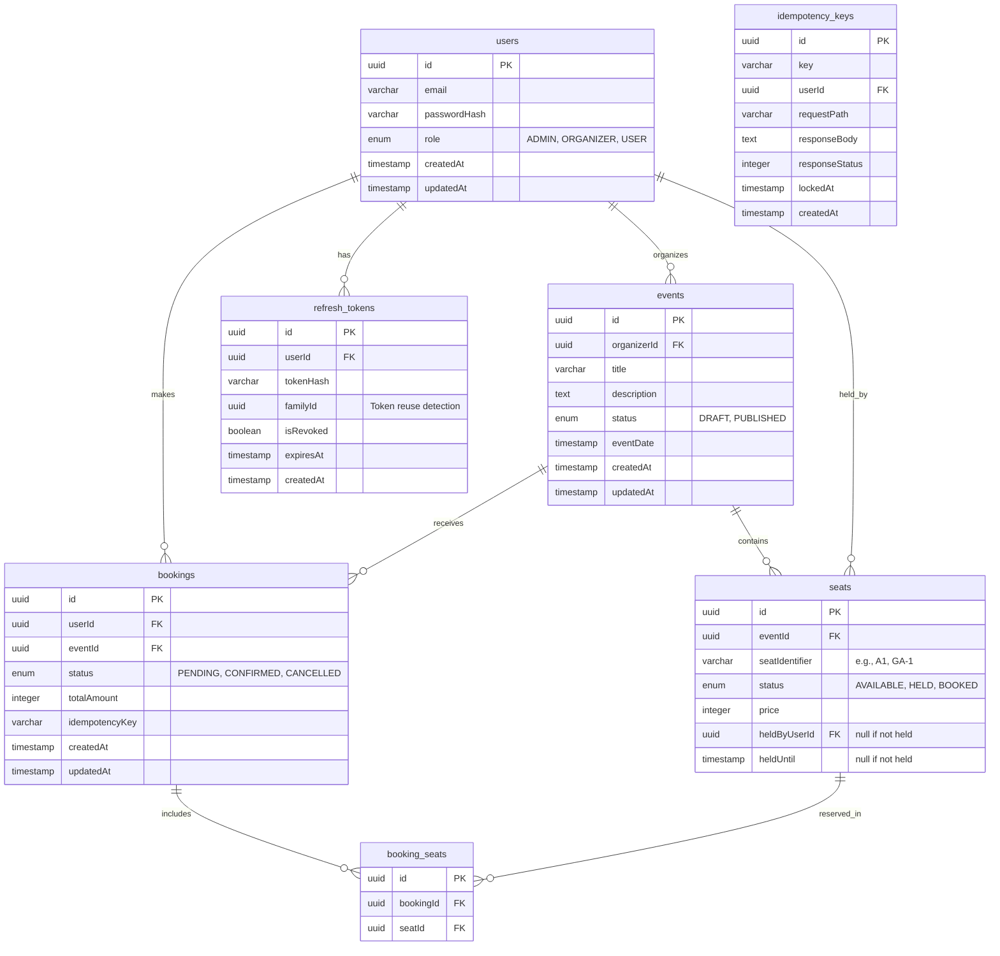

# Event Ticket Booking System

A highly concurrent, full-stack event ticket booking system built to handle real inventory with zero overselling, robust role-based access control, and a premium frontend experience.

## Architecture

This project is structured as a Monorepo using `pnpm` workspaces.
- `apps/web`: Next.js 16 App Router frontend (React 19).
- `apps/api`: NestJS 11 backend.

**Tech Stack:**
- **Database**: PostgreSQL (hosted on Neon) + Drizzle ORM
- **Cache & Queues**: Redis & BullMQ
- **Auth**: JWT (Short-lived access tokens + Secure refresh token rotation)
- **Containerization**: Docker & docker-compose (for local Redis/services)
- **Validation**: Zod (Full stack shared schemas)

## Database Schema (ER Diagram)

## Race Condition & Concurrency Strategy

To solve the core technical challenge of high-concurrency ticket drops, we are modeling explicit individual `seats` (or numbered GA slots) rather than a single `availableSeats` counter on the `events` table.

**The process:**
1. **Seat Hold Phase:** When a user initiates a booking, we execute `SELECT * FROM seats WHERE id IN (...) AND status = 'AVAILABLE' FOR UPDATE SKIP LOCKED`. 
   - *Why Pessimistic Locking?* We lock specific row(s) to strictly serialize inventory allocation. By modeling individual seats, users contend for different seat rows rather than bottlenecking on a single event counter row lock. 
   - *Why `SKIP LOCKED`?* If someone else is actively acquiring the lock on Seat A1, the database skips it instead of hanging, allowing the system to instantly inform the current user that the seat is unavailable, improving UX during flash sales.
2. **Hold Expiry:** Seats move to a `HELD` state. A BullMQ delayed job is scheduled. If the booking isn't confirmed before the timer expires, the queue worker releases the hold back to `AVAILABLE`.
3. **Idempotent Confirm Phase:** Checkout confirmation endpoints require an idempotency key (stored in `idempotency_keys`). If a network retry occurs, we return the cached response rather than processing double-payment or double-decrementing inventory.

## Development Setup

1. Check `.env.example` and create `.env` files in both the root and `/apps/api`, `/apps/web`.
2. For local db branches, use Neon.
3. Start Redis: `docker-compose up -d redis`
4. Install dependencies: `pnpm install`
